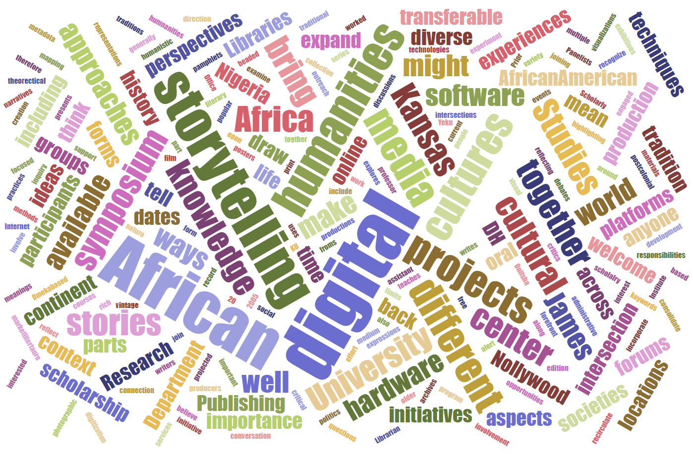

The African Digital Humanities initiative at the University of Kansas is headed by **[James Yeku](https://afs.ku.edu/james-yeku)** in the Department of **[African and African-American Studies](https://afs.ku.edu/)** in partnership with staff from the **[Institute for Digital Research in the Humanities](http://idrh.ku.edu)**, and presents opportunities for engaged discussions that center on African perspectives and projects in the digital humanities. 

African DH explores the intersection of traditional humanistic inquiry in Africa and digital media. We bring togther people and projects who examine this important connection, highlighting the ways in which African cultural producers incorporate digital technologies and methods into their work, while exploring on how African writers and critics experiment with digital media hardware and software more generally.

We draw on postcolonial and African theorectical approaches to the Internet as the medium of the digital cultural record, even as we remain alert to the limits of digital platforms, the politics of representations and knowledge production in the digital humanities, as well as to questions on the nature and uses of digital archives.
